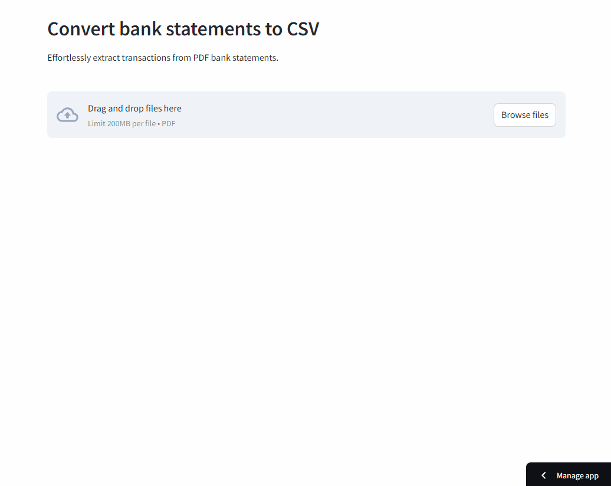

Statement Sensei converts bank statement PDFs into editable transaction tables using the [monopoly](https://github.com/benjamin-awd/monopoly) CLI library. Review extracted transactions, choose which columns to keep, adjust column names, set text, number, currency, date, or datetime formats, then export CSV or Excel files.

<h3 align="center">
    🎉 Statement Sensei is now live! 🎉
    <br><br>
    Try it out: <br>
    <a href="https://statementsensei.streamlit.app/">https://statementsensei.streamlit.app/</a>
</h3>

<p align="center">
    
</p>

# Usage

Statement Sensei can be run as an offline application on Windows, MacOS or Linux.

> ⚠️ Note: Windows does not work currently due to upstream build issues with `pdftotext`.

The offline application runs Streamlit locally, and uses a [WebView](https://tauri.app/v1/references/webview-versions/) window to view the browser frontend at http://localhost:8501.

Supported banks:
| Bank                                   | Credit Statement   | Debit Statement       |
|----------------------------------------|--------------------|-----------------------|
| Bank of America                        | ✅                 | ✅                   |
| Bank of Montreal (BMO)                 | ✅                 | ✅                   |
| Canadian Imperial Bank of Commerce (CIBC) | ✅                 | ✅                   |
| Canadian Tire Bank                     | ✅                 | ❌                   |
| Capital One Canada                     | ✅                 | ❌                   |
| Chase                                  | ✅                 | ❌                   |
| Citibank                               | ✅                 | ❌                   |
| DBS/POSB                               | ✅                 | ✅                   |
| HSBC                                   | ✅                 | ❌                   |
| Maybank                                | ✅                 | ✅                   |
| OCBC                                   | ✅                 | ✅                   |
| Royal Bank of Canada (RBC)             | ✅                 | ✅                   |
| Schwab Bank                            | N/A                | ✅                   |
| Scotiabank                             | ✅                 | ✅                   |
| Standard Chartered                     | ✅                 | ❌                   |
| TD Canada Trust                        | ✅                 | ✅                   |
| Trust                                  | ✅                 | ❌                   |
| UOB                                    | ✅                 | ✅                   |
| US Bank                                | ✅                 | ❌                   |
| Zürcher Kantonalbank                   | ❌                 | ✅                   |

# Installation

> [!WARNING]
> The offline app may raise security warnings during installation.

Specifically on MacOS, the application will show an "app is damaged and can't be opened" error.

These security warnings happen because the release binaries are unsigned, and are incorrectly flagged as malware.

To get around this, follow these steps for [MacOS](https://support.apple.com/en-sg/guide/mac-help/mh40616/mac) / [Windows](https://stackoverflow.com/questions/54733909/windows-defender-alert-users-from-my-pyinstaller-exe).

The Windows Defender alert can be bypassed by clicking "More info" -> "Run anyway".

# Development
Install system dependencies using brew or apt-get (necessary since `pdftotext` needs them)

```sh
apt-get install build-essential libpoppler-cpp-dev pkg-config ocrmypdf
```

or

```sh
brew install gcc@11 pkg-config poppler ocrmypdf
```

Install app dependencies with uv:
```shell
uv venv
source .venv/bin/activate
uv pip install -e .
```

To run the consumer-facing application:
```shell
python entrypoint.py
```

To run the application in developer mode:
```shell
streamlit run webapp/app.py
```

# Streamlit Community Cloud

Use these settings when moving the app to Streamlit Community Cloud:

- Repository: the GitHub repository containing this project
- Branch: the branch with the refreshed app
- Main file path: `webapp/app.py`
- Python version: 3.12 is recommended

The cloud build uses `requirements.txt`, which installs this source project with the OCR extra. System packages required by PDF and OCR processing are listed in `packages.txt`.

## Docker
Otherwise, to run the application as a container:
```sh
docker compose up
```

or:

```sh
docker pull benjaminawd/statementsensei:latest
docker run -p 8501:8501 benjaminawd/statementsensei:latest
```

If running locally with docker: you can either store passwords in an environment variable as a string

```sh
export PDF_PASSWORDS='["pass123", "otherpw123"]'
```

or store them in an .env file in the project root:

```sh
echo 'PDF_PASSWORDS=["foo"]' > .env
```

# Features
- Supports uploading multiple bank statements
- Allows unlocking of PDFs using user-provided credentials via the frontend
- Reviews extracted transactions in an editable table
- Shows summary metrics and transaction filters
- Lets users include, rename, type, and format columns before export
- Exports formatted CSV files and typed Excel workbooks
